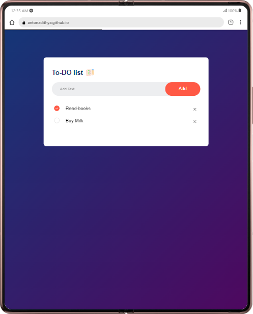

<h1 align="center" id="title">To-Do App with JavaScript</h1>

<h2>Description 📙</h2>

The To-Do App is a web-based task management tool that allows users to add check and delete tasks dynamically. The application provides a clean and intuitive interface for managing your daily tasks and responsibilities.

<h2>Features 🏆</h2>
 
<ul>

<li> <bold>Add Task: Enter a task in the input box and click the "Add" button to add it to your to-do list.

<li>Keyboard Shortcut: Press "Enter" to quickly add a task without using the mouse.
<li>Check/Uncheck Tasks: Click on a task to mark it as completed or uncompleted.

<li>Delete Task: Click on the delete icon (✗) next to a task to remove it from the list.

<li>Persistent Storage: Your tasks are saved locally, so they persist even if you refresh or close the browser window.

<li>Responsive Design: The app is designed to work seamlessly on various screen sizes.
</ul>

 

<h2>Usage 🔍</h2>
<ol>
  <li>1.Open the To-Do App in your web browser.</li>
  <li>2.Enter a task in the input box and click "Add" or press "Enter" to add it to your to-do list.</li>
  <li>3.Click on a task to mark it as completed or uncompleted.</li>
<li>4.Click on the delete icon (✗) next to a task to remove it from the list.
<li>5.Your tasks are saved locally, so they will persist between sessions.
</ol>
 
<h3 align="left">Support Me 💖:</h3>

  

